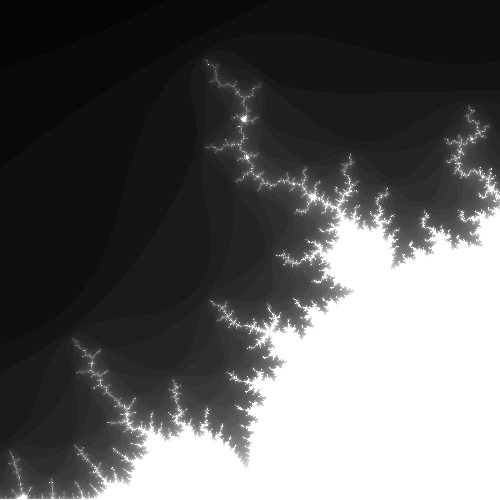
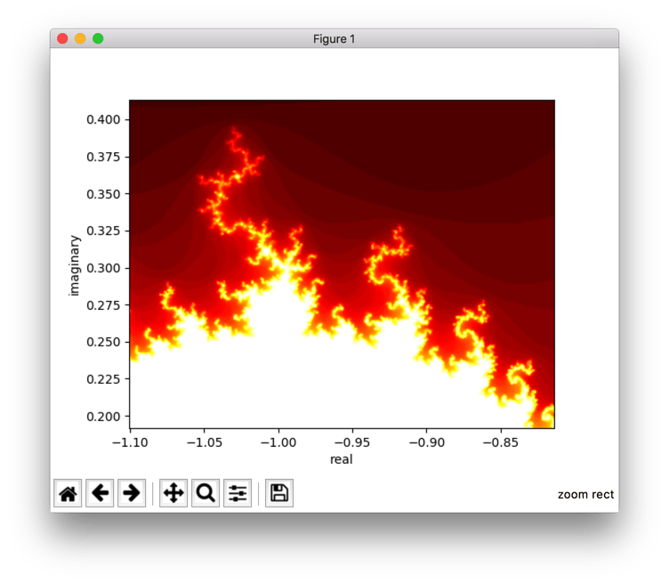

# Mandelbrot

`mandelbrot.py` generates image plots of mandelbrot sets.


## What is the Mandelbrot set?

> The Mandelbrot set is the set of complex numbers
> 
> for which the function
> =z^{2}+c)
> does not diverge when iterated from
> 
> i.e., for which the sequence
> ),
> \)),
> etc., remains bounded in absolute value.

Source: [Mandelbrot set (wikipedia)](https://en.wikipedia.org/wiki/Mandelbrot_set)


## Usage

```
usage: mandelbrot.py [-h] [-d {matplotlib,pil,tkinter}] [-m MAX_ITERS]
                     [-W WIDTH] [-H HEIGHT] [-r REAL_MIN] [-i IMAG_MIN]
                     [-s IMAG_SCALE] [-R]

Mandelbrot set image generator.

optional arguments:
  -h, --help            show this help message and exit
  -d {matplotlib,pil,tkinter}, --display {matplotlib,pil,tkinter}
                        which library to use for image display (default: pil)
  -m MAX_ITERS, --max_iters MAX_ITERS
                        max iterations to perform for each position when
                        determining if in the mandelbrot set (default: 50)
  -W WIDTH, --width WIDTH
                        output image pixel width (default: 2000)
  -H HEIGHT, --height HEIGHT
                        output image pixel height (default: 2000)
  -r REAL_MIN, --real_min REAL_MIN
                        minimum real axis value on the complex plane (default:
                        -1.5)
  -i IMAG_MIN, --imag_min IMAG_MIN
                        minimum imaginary axis value on the complex plane
                        (default: -1.0)
  -s IMAG_SCALE, --imag_scale IMAG_SCALE
                        size to limit render on the imaginary axis (default:
                        2.0)
  -R, --fake_complex    calculate without using native Python complex number
                        objects (default: False)
```


## Examples

### Default behavior

```bash
./mandelbrot.py
```

[2000x2000 pixels output image](examples/sample_output_default_full.png)

### Custom offset position, scale, and image size

```bash
./mandelbrot.py --imag_min -0.5 --imag_scale 0.5 --width 500 --height 500
```

```
0.0001 sec for linspace and zeros
0.3326 sec for iterations
performed 4863214 mandelbrot iterations
0.0054 sec for normalize
0.0026 sec for PIL
```



### Using matplotlib image viewer

```bash
./mandelbrot.py --display matplotlib
```


